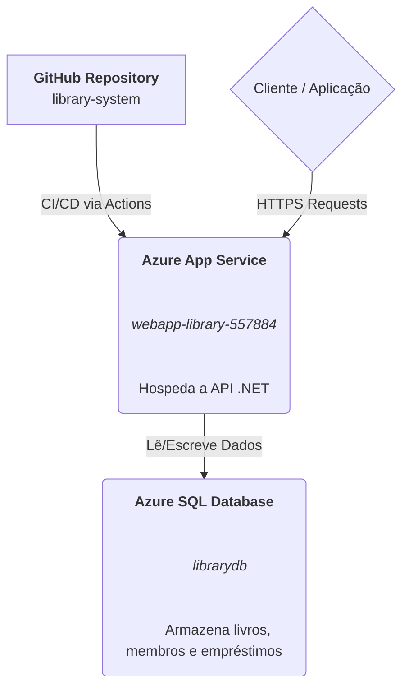

# Library System API


## 📚 1. Visão Geral da Solução

A **Library System API** é uma API RESTful desenvolvida em .NET 8 com Clean Architecture para gerenciar um sistema completo de biblioteca. A solução oferece endpoints para gestão de livros, membros e empréstimos, com funcionalidades avançadas como controle de multas por atraso, renovação de empréstimos e gestão de disponibilidade de cópias.

### Principais Funcionalidades

* **Gestão de Livros:** Cadastro completo com ISBN, título, autor, editora, categoria e controle de cópias
* **Gestão de Membros:** Registro de membros com validação de e-mail e senha seguros
* **Gestão de Empréstimos:** Controle de empréstimos com cálculo automático de multas por atraso
* **Escalabilidade:** Infraestrutura cloud-native na Azure com CI/CD via GitHub Actions

---

## 🏗️ 2. Arquitetura da Solução

A solução segue os princípios de **Clean Architecture** e **Domain-Driven Design (DDD)**:

```
library-system/
├── src/
│   ├── Domain/              # Entidades, Value Objects, Interfaces
│   │   ├── Entity/
│   │   │   ├── Book.cs      # Livros com controle de disponibilidade
│   │   │   ├── Member.cs    # Membros da biblioteca
│   │   │   └── Loan.cs      # Empréstimos com cálculo de multas
│   │   ├── ValueObjects/
│   │   │   ├── Email.cs     # Validação de e-mail
│   │   │   └── Password.cs  # Validação de senha segura
│   │   └── Interfaces/
│   ├── Application/         # DTOs, Services, Business Logic
│   │   ├── DTOs/
│   │   │   ├── BookDTO.cs
│   │   │   ├── MemberDTO.cs
│   │   │   └── LoanDTO.cs
│   │   └── Services/
│   │       ├── BookService.cs
│   │       ├── MemberService.cs
│   │       └── LoanService.cs
│   ├── Infrastructure/      # Persistence, EF Core, Repositories
│   │   ├── Persistence/
│   │   │   ├── Context/
│   │   │   ├── Mappings/
│   │   │   └── Repositories/
│   │   └── Migrations/
│   └── Api/                 # Controllers, Endpoints REST
│       └── Controllers/
│           ├── BooksController.cs
│           ├── MembersController.cs
│           └── LoansController.cs
```

### Arquitetura de Infraestrutura (Azure)



---

## 🚀 3. Deploy Automatizado com GitHub Actions

O deploy está completamente automatizado via **GitHub Actions**. A cada push na branch `main`, o workflow:

1. ✅ Compila a aplicação .NET 8
2. ✅ Registra os Resource Providers da Azure
3. ✅ Cria a infraestrutura completa (Resource Group, SQL Server, Database, App Service)
4. ✅ Configura as conexões e variáveis de ambiente
5. ✅ Faz deploy da aplicação
6. ✅ Reinicia o serviço

### Configuração dos Secrets no GitHub

Para configurar o deploy automático, adicione os seguintes secrets no seu repositório GitHub:

1. Acesse: `Settings` → `Secrets and variables` → `Actions` → `New repository secret`

2. Adicione os seguintes secrets:

**AZURE_CREDENTIALS:**
```json
{
  "clientId": "<seu-client-id>",
  "clientSecret": "<seu-client-secret>",
  "subscriptionId": "<sua-subscription-id>",
  "tenantId": "<seu-tenant-id>"
}
```

Para criar estas credenciais, execute:
```bash
az ad sp create-for-rbac --name "library-system-sp" --role contributor \
    --scopes /subscriptions/{subscription-id}/resourceGroups/{resource-group} \
    --sdk-auth
```

**DB_ADMIN_USER:** Nome do usuário administrador do SQL Server (ex: `sqladmin`)

**DB_ADMIN_PASSWORD:** Senha do administrador (deve conter maiúsculas, minúsculas, números e caracteres especiais)

### Executar o Deploy

Após configurar os secrets, faça um push para a branch `main`:

```bash
git add .
git commit -m "Deploy library system"
git push origin main
```

O workflow será executado automaticamente e você pode acompanhar em `Actions` no GitHub.

---

## 📖 4. Documentação da API

A API expõe os seguintes endpoints. A URL base após deploy será `https://webapp-library-557884.azurewebsites.net`.

### 📚 Books (Livros)

#### GET /api/books
Lista todos os livros com paginação.

**Query Parameters:**
- `pageNumber` (int, opcional): Número da página (default: 1)
- `pageSize` (int, opcional): Itens por página (default: 10)

**Response 200 OK:**
```json
[
  {
    "bookId": "guid",
    "isbn": "978-8535902774",
    "title": "Clean Code",
    "author": "Robert C. Martin",
    "publisher": "Alta Books",
    "publicationYear": 2009,
    "category": "Technology",
    "totalCopies": 3,
    "availableCopies": 2,
    "status": 0
  }
]
```

#### GET /api/books/{id}
Obtém um livro específico por ID.

#### POST /api/books
Cria um novo livro.

**Request Body:**
```json
{
  "isbn": "978-1234567890",
  "title": "Novo Livro",
  "author": "Autor Example",
  "publisher": "Editora Example",
  "publicationYear": 2024,
  "category": "Technology",
  "totalCopies": 5
}
```

#### PUT /api/books/{id}
Atualiza um livro existente.

#### DELETE /api/books/{id}
Remove um livro.

---

### 👥 Members (Membros)

#### GET /api/members
Lista todos os membros com paginação.

#### GET /api/members/{id}
Obtém um membro específico por ID.

#### POST /api/members
Cadastra um novo membro.

**Request Body:**
```json
{
  "name": "João Silva",
  "email": "joao.silva@email.com",
  "password": "Senha@123",
  "phone": "11987654321"
}
```

**Validações:**
- Email deve ser válido
- Senha deve conter: 8+ caracteres, maiúscula, minúscula, número e caractere especial

#### PUT /api/members/{id}
Atualiza um membro existente.

#### DELETE /api/members/{id}
Remove um membro.

---

### 📋 Loans (Empréstimos)

#### GET /api/loans
Lista todos os empréstimos com paginação.

#### GET /api/loans/{id}
Obtém um empréstimo específico por ID.

#### POST /api/loans
Registra um novo empréstimo.

**Request Body:**
```json
{
  "bookId": "guid-do-livro",
  "memberId": "guid-do-membro",
  "loanDate": "2024-10-07T00:00:00Z",
  "dueDate": "2024-10-21T00:00:00Z",
  "notes": "Observações opcionais"
}
```

**Regras de Negócio:**
- O livro deve ter cópias disponíveis
- A data de vencimento padrão é 14 dias após o empréstimo
- Multa de R$ 2,00 por dia de atraso após a devolução

#### PUT /api/loans/{id}
Atualiza um empréstimo (usado para registrar devolução).

**Request Body para Devolução:**
```json
{
  "loanId": "guid",
  "bookId": "guid",
  "memberId": "guid",
  "loanDate": "2024-10-07T00:00:00Z",
  "dueDate": "2024-10-21T00:00:00Z",
  "returnDate": "2024-10-25T00:00:00Z",
  "status": 1,
  "lateFee": 8.00
}
```

#### DELETE /api/loans/{id}
Cancela um empréstimo.

---

## 🗄️ 5. Banco de Dados

### Diagrama Entidade-Relacionamento

```
Members                 Loans                   Books
├─ MemberId (PK)       ├─ LoanId (PK)         ├─ BookId (PK)
├─ Name                ├─ BookId (FK) ────────┼─> BookId
├─ Email (unique)      ├─ MemberId (FK) ──┐   ├─ ISBN (unique)
├─ Password            │                    │   ├─ Title
├─ Phone               ├─ LoanDate          │   ├─ Author
├─ RegistrationDate    ├─ DueDate           │   ├─ Publisher
└─ IsActive            ├─ ReturnDate        │   ├─ PublicationYear
                       ├─ Status            │   ├─ Category
                       ├─ LateFee           │   ├─ TotalCopies
                       └─ Notes             │   ├─ AvailableCopies
                                            │   └─ Status
                                            │
                                            └─> MemberId
```

### Status Enums

**BookStatus:**
- 0 = Available (Disponível)
- 1 = Borrowed (Emprestado - todas cópias)
- 2 = Maintenance (Em manutenção)
- 3 = Lost (Perdido)

**LoanStatus:**
- 0 = Active (Ativo)
- 1 = Returned (Devolvido)
- 2 = Late (Atrasado)
- 3 = Cancelled (Cancelado)

---

## 🔧 6. Desenvolvimento Local

### Pré-requisitos

- [.NET 8 SDK](https://dotnet.microsoft.com/download/dotnet/8.0)
- [SQL Server](https://www.microsoft.com/sql-server) ou SQL Server Express
- [Visual Studio 2022](https://visualstudio.microsoft.com/) ou [VS Code](https://code.visualstudio.com/)

### Executar Localmente

1. Clone o repositório:
```bash
git clone https://github.com/seu-usuario/library-system.git
cd library-system
```

2. Configure a connection string em `appsettings.Development.json`:
```json
{
  "ConnectionStrings": {
    "DefaultConnection": "Server=localhost;Database=librarydb;Trusted_Connection=True;TrustServerCertificate=True;"
  }
}
```

3. Execute as migrations:
```bash
cd library-system/src/Infrastructure
dotnet ef database update
```

4. Execute a aplicação:
```bash
cd ../Api
dotnet run
```

5. Acesse a documentação Swagger:
```
https://localhost:5001/swagger
```

---

## 📝 7. Scripts de Entrega

* **[.github/workflows/azure-deploy.yml](.github/workflows/azure-deploy.yml):** Workflow completo de CI/CD
* **[script_bd.sql](script_bd.sql):** Script DDL para criação do banco de dados
* **[deploy.sh](deploy.sh):** Script legado Azure CLI (mantido para referência)

---

## 🎯 8. Funcionalidades Avançadas

### HATEOAS
Todos os endpoints retornam links hipermídia para navegação:
```json
{
  "bookId": "guid",
  "title": "Clean Code",
  "links": [
    {
      "href": "/api/books/guid",
      "rel": "self",
      "method": "GET"
    },
    {
      "href": "/api/books/guid",
      "rel": "update_book",
      "method": "PUT"
    }
  ]
}
```

### Paginação
Todos os endpoints GET de listagem suportam paginação com metadados:
```
X-Pagination: {"TotalCount":50,"PageSize":10,"CurrentPage":1,"TotalPages":5}
```

### Value Objects
- **Email:** Validação automática de formato
- **Password:** Validação de complexidade (8+ chars, maiúscula, minúscula, número, especial)

---

## 👨‍💻 Autor

Desenvolvido para o projeto FIAP - Sistema de Biblioteca

**Contato:** library@fiap.com.br

---

## 📄 Licença

Este projeto é parte do programa acadêmico FIAP.
